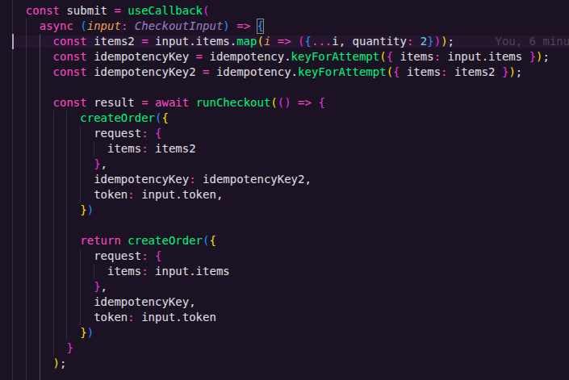

## Manual concurrency test



The source code for copy and try manually

```TS
  const submit = useCallback(
    async (input: CheckoutInput) => {
      const items2 = input.items.map(i => ({...i, quantity: 2}));
      const idempotencyKey = idempotency.keyForAttempt({ items: input.items });
      const idempotencyKey2 = idempotency.keyForAttempt({ items: items2 });

      const result = await runCheckout(() => {
          createOrder({
            request: {
              items: items2
            },
            idempotencyKey: idempotencyKey2,
            token: input.token,
          })

          return createOrder({
            request: {
              items: input.items
            },
            idempotencyKey,
            token: input.token
          })
        }
      );

      if (result.status === "CONFIRMED") {
        idempotency.startNewAttempt();
      }

      return result;
    },
    [idempotency, runCheckout]
  );
```

Testing the checkout with two different approachs.

* Item having only 2 stock:
  * First checkout was succefull
  * Second failed due stock

* Item having more than 3 stock and the second by inside the stock limit:
  * First checkout was succefull
  * Second checkout was succefull

So the concurrency is handled correclty

## Teste manual de concorrência


Código fonte alterado para teste

```TS
  const submit = useCallback(
    async (input: CheckoutInput) => {
      const items2 = input.items.map(i => ({...i, quantity: 2}));
      const idempotencyKey = idempotency.keyForAttempt({ items: input.items });
      const idempotencyKey2 = idempotency.keyForAttempt({ items: items2 });

      const result = await runCheckout(() => {
          createOrder({
            request: {
              items: items2
            },
            idempotencyKey: idempotencyKey2,
            token: input.token,
          })

          return createOrder({
            request: {
              items: input.items
            },
            idempotencyKey,
            token: input.token
          })
        }
      );

      if (result.status === "CONFIRMED") {
        idempotency.startNewAttempt();
      }

      return result;
    },
    [idempotency, runCheckout]
  );
```

Teste realizado de duas formas.

* Item com apenas 2 de estoque:
  * Primeiro checkout teve sucesso
  * Segundo falhou por estoque faltando

* Item com mais de 3 e o segundo item dentro do limite disponível de estoque:
  * Primeiro checkout teve sucesso
  * Segundo checkout teve sucesso

Concorrência tratada corretamente